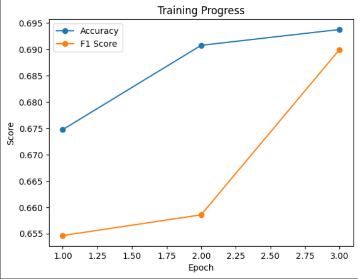
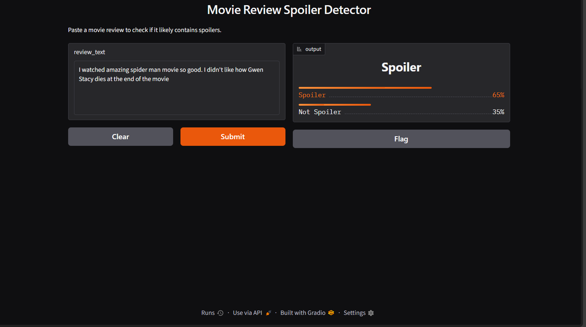
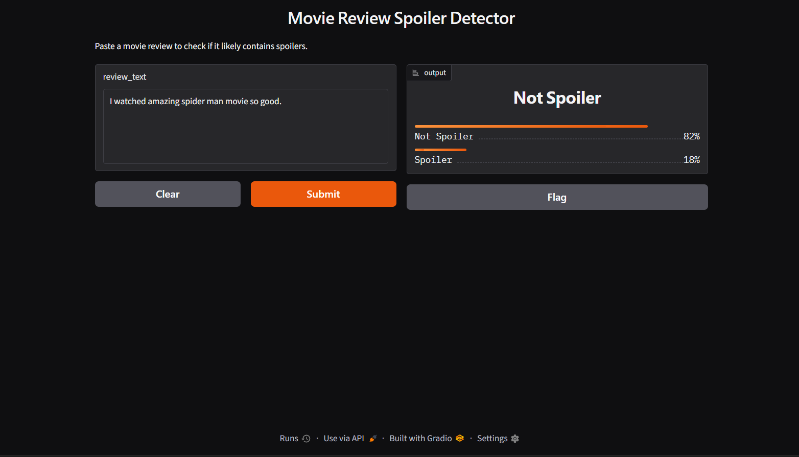
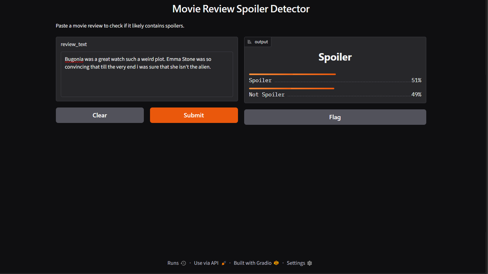
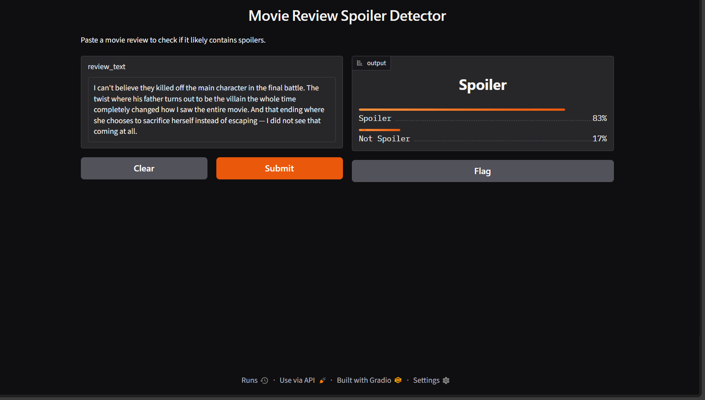

# 🎬 Movie Review Spoiler Detector

A fine-tuned DistilBERT model that predicts whether a movie review contains spoilers, based purely on the review text.

**Live demo (local):** run `app.py` — see instructions below
**Model:** [huggingface.co/toosharm/spoiler-detector](https://huggingface.co/toosharm/spoiler-detector)

---

## Problem

Movie review platforms often bury spoilers inside otherwise normal-looking reviews. This project fine-tunes a transformer model to flag whether a given review is likely to contain spoiler content, using only the review's text.

## Dataset

- **Source:** [IMDB Spoiler Dataset](https://www.kaggle.com/datasets/rmisra/imdb-spoiler-dataset) (Kaggle, ~574K reviews)
- **Used:** 20,000 reviews (10,000 spoiler / 10,000 non-spoiler), randomly sampled and balanced from the full dataset
- **Split:** 80% train / 20% test

## Approach

- **Model:** `distilbert-base-uncased`, fine-tuned for binary sequence classification
- **Tokenization:** max length 256 tokens, padded/truncated
- **Training:** 3 epochs, learning rate 2e-5, batch size 16
- **Framework:** HuggingFace `transformers` + `Trainer` API

## Results

| Epoch | Training Loss | Validation Loss | Accuracy  | F1        |
| ----- | ------------- | --------------- | --------- | --------- |
| 1     | 1.226         | 1.191           | 67.5%     | 65.5%     |
| 2     | 1.141         | 1.165           | 69.1%     | 65.9%     |
| 3     | 1.102         | 1.149           | **69.4%** | **69.0%** |



These results are consistent with published text-only baselines on this exact dataset — for reference, a plain BERT model in a 2025 benchmark paper scored 77.8% accuracy but only 44.0% F1 on the same dataset (likely due to class imbalance in that setup). My balanced-sampling approach yields a more even precision/recall tradeoff, reflected in the higher F1.

State-of-the-art results on this dataset (85%+ accuracy) rely on graph-based models incorporating user history, genre, and social network data — not text alone. This project focuses specifically on what's learnable from review text in isolation.

## Key finding: sequence length limits

Review lengths in this dataset average 281 words (up to 1,472), while DistilBERT supports a maximum of 512 tokens. Since spoiler content often appears later in a review (after general, non-spoiler commentary), truncation likely removes exactly the content most relevant to the spoiler/non-spoiler decision for longer reviews — a real constraint of using compact transformer architectures for this task.

## Example predictions

**Spoiler (62% confidence):**

> "I watched amazing spider man movie so good. In the end of the movie gwen stacy dies."
> 

**Not spoiler (82% confidence)** — same review, spoiler sentence removed:

> "I watched amazing spider man movie so good."
> 

**Spoiler (51% confidence):**

> [Bugonia was a great watch such a weird plot.Emma Stone was so convincing that till the very end i was sure she isn't the alien.]- Spoiler
> This example illustrates realistic model uncertainty — the review contains ambiguous or subtle signals rather than clear spoiler language, and the model's near-50% confidence reflects that ambiguity rather than a wrong or overconfident guess.
> 

**Not spoiler (83% confidence):**

> [I can't believe they killed off the main character in the final battle. The twist where his father turns out to be the villian in the whole time completely changed how i saw the entire movie. And that ending where she choose to sacrifice herself instead of escaping -- I did not see that coming at all.] + Spoiler
> 

_(screenshots in `/screenshots`)_

## Running locally

```bash
git clone https://github.com/sorrytooshar/spoiler-detector.git
cd spoiler-detector
python -m venv venv
venv\Scripts\activate
pip install -r requirements.txt
python app.py
```

Model weights are downloaded automatically from HuggingFace Hub on first run.

## Tech stack

Python, PyTorch, HuggingFace Transformers, Gradio

## Limitations & future work

- Text-only signal caps achievable accuracy for this task — incorporating genre/user metadata (as in published graph-based approaches) would likely improve results
- Sequence truncation at 256/512 tokens may lose spoiler-relevant content in longer reviews
- Class imbalance in the original dataset (74% non-spoiler) was addressed via balanced sampling for this project
